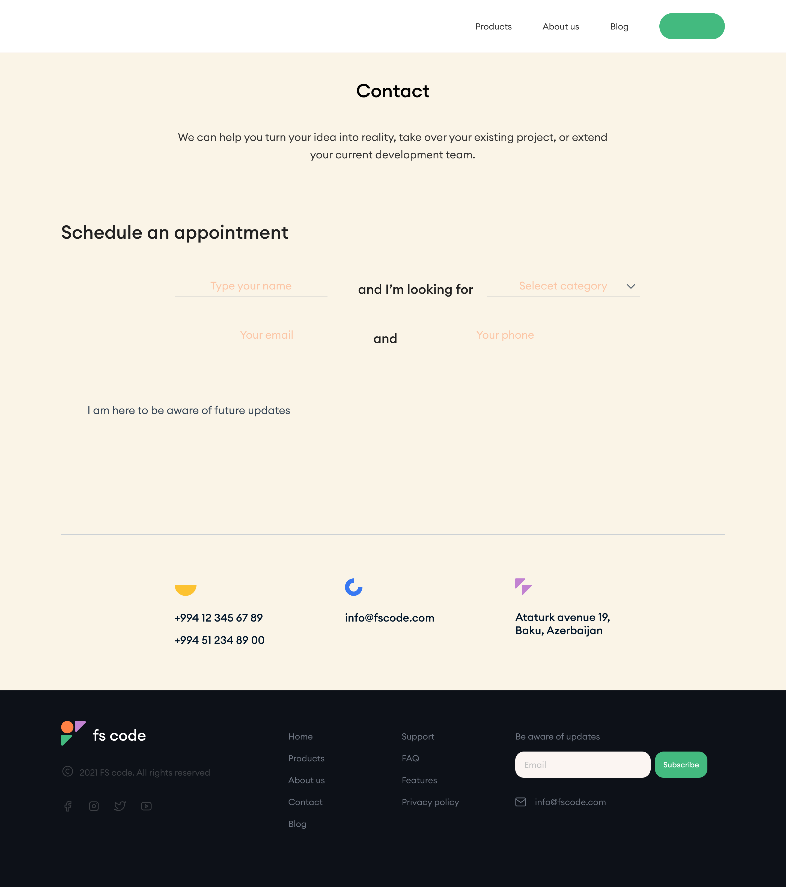

# FS Code :dizzy:

## Demo 🎯
[Final Project: FS-Code Website] (https://defaultsabina.github.io/fs-code-website/)

## Project Overview
This project is a website developed as the final project for the Tech Academy course. The application showcases a website with three main pages: Home, Contact, and Blog.

## Features
- **Home Page:** The landing page that provides an overview of the website and its main features.

- **Contact Page:** A page with a contact form for users to get in touch.

- **Blog Page:** A page that displays blog posts.

## Project Structure
The project directory is structured as follows:
- assets/
  - images/
  - fonts/
- index.html
- contact.html
- blog.html
- styles/
  - main.css
- scripts/
  - main.js

## Technologies Used
- HTML
- CSS
- JavaScript

For any inquiries or feedback, please contact [smamedova5010@gmail.com] 

[Get project's figma file](https://www.figma.com/design/tCN212vrDv4b4Q6XnsNHKT/project1?node-id=0-1&t=WQohEfK3AXk4ssZZ-1)

